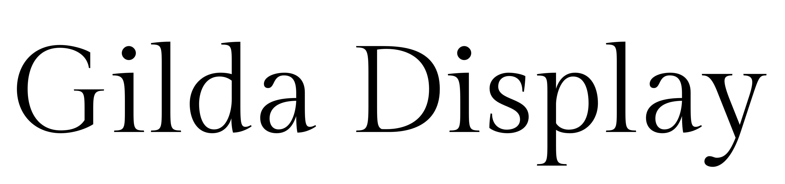
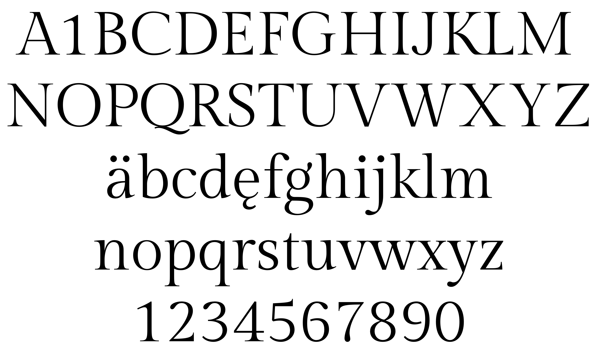

### Gilda Display

Gilda Display is a font of classic proportions, in which we can see the finest treatment of curves, strokes and serifs. The high stroke contrast has especially smooth transitions, making this type perfect for the world of fashion, jewelry and luxury items. Gilda Display typically contributes all its glamor to headlines, but the considered design of this font gives it potential for use in longer texts with a fine page texture.

### Designer

* Eduardo Rodríguez Tunni

Eduardo Tunni was born in Buenos Aires, Argentina, in 1963. He studied graphic design at the University of Buenos Aires (UBA) and later specialized in typographic design. He co-founded the type foundry "Tipo" and some of his published there fonts were exhibited, selected and awarded around the world. For 10 years he was a teacher of the Master Career of Type Design at the UBA where he continues as external consultant. He made multilingual custom fonts for magazines, newspapers, universities, companies and countries with the collaboration of other colleagues. He has developed design methods that have been incorporated into the main typography design software that collaborates with typographic production.

### License

Licensed under the [*SIL Open Font License, 1.1*](http://scripts.sil.org/OFL); you may not use this file except in compliance with the License.

To contribute to the project contact Eduardo Rodríguez Tunni > edu@tipo.net.ar
